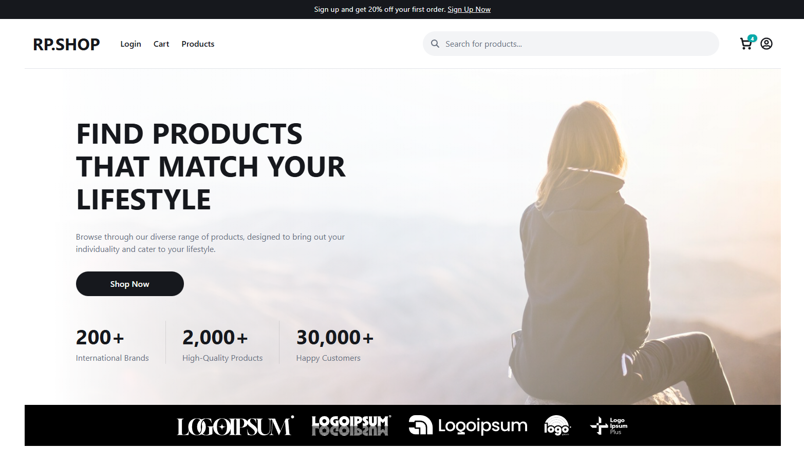
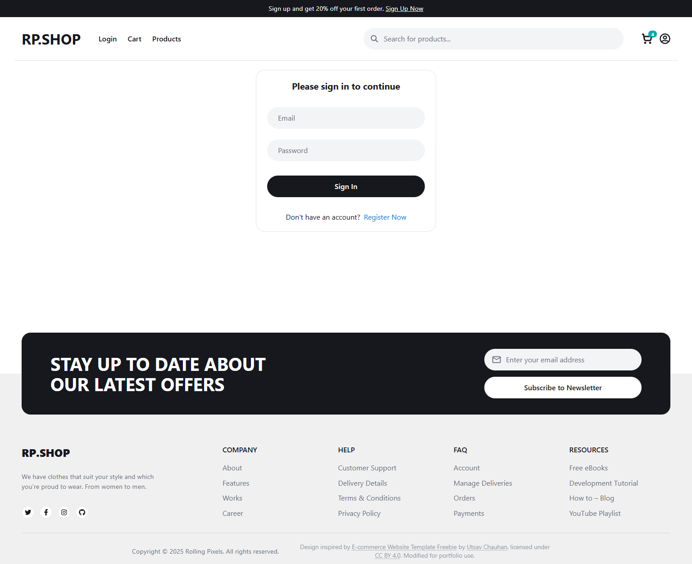
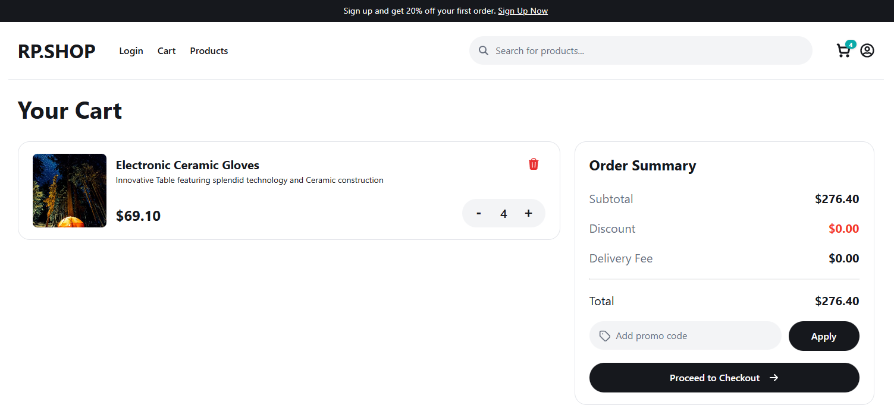
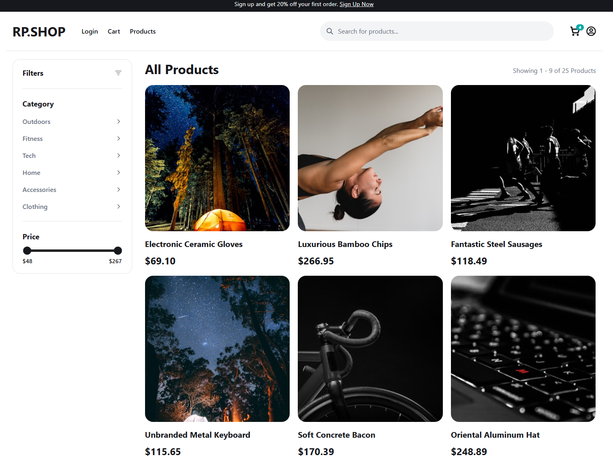
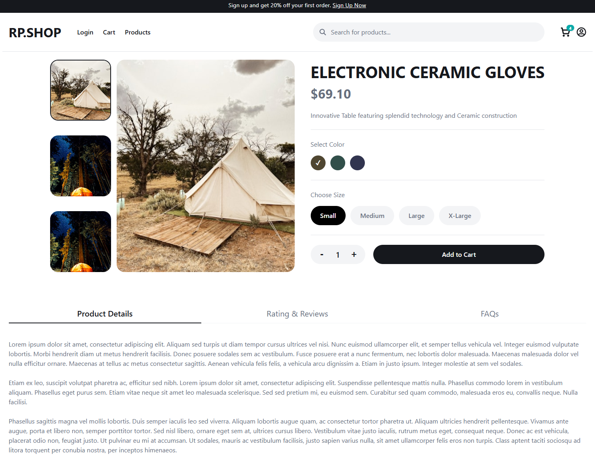

# E-Commerce Storefront (Full-Stack)

A full-stack **React + TypeScript + Node.js/Express** ecommerce storefront application built for scalability and maintainability.
Includes:

- Frontend hosted on **Netlify**
- Cloud-hosted backend on **Render**
- Database, storage, and authentication handled with **Supabase**
- Secure environment management using **Infisical** or `.env` files
- Image proxying for protected Supabase buckets

## Features

### Frontend

- **React 18 + TypeScript**
- **SCSS Modules** for localized styling
- **Reusable components:** (`Button`, `ProductCard`, etc.)
- **Responsive grid & mobile filters**
- **React Context** for cart and UI state
- **Pagination, sorting, filtering**
- **Vite Dev Server:** fast builds and hot module reloading

### Backend (Node.js + Express)

- REST API hosted on **Render**
- Supabase service role integration for secure DB access
- Routes:
  - /api/payment → Stripe checkout
  - /api/user → auth profile helpers
  - /api/image → Supabase image proxy (private bucket support)
- CORS locked to Netlify URL

### Database

- **Supabase** with two tables:
  - products_dev for local dev
  - products_prod for production
- Automatic environment-based table selection

## Demo / Screenshots

### Live Demo

[https://dillon-ecommerce-app.netlify.app/](https://dillon-ecommerce-app.netlify.app/)

### Home Page



### Login Page



### Cart Page



### Products Page



### Product Details Page



## Project Structure

```bash
ecommerce-storefront/
│
├── frontend/
│   ├── src/
│   │   ├── assets/     # Images, fonts, and icons
│   │   ├── components/ # Reusable UI components
│   │   ├── context/    # Global React contexts (cart, UI state, providers)
│   │   ├── hooks/      # Custom React hooks
│   │   ├── pages/      # Page-level views
│   │   ├── routes/     # Centralized route definitions / React Router config
│   │   ├── scripts/    # One-off utilities like seeders or data migration helpers
│   │   ├── styles/     # Global and SCSS module files
│   │   ├── types/      # Shared TypeScript interfaces and type definitions
│   │   ├── utils/      # Helper functions (demo reviews, pagination, etc.)
│   │   └── main.tsx    # Frontend app entry point
│   │
│   ├── public/         # Static assets
│   ├── index.html
│   ├── .env            # Local development environment variables
│   ├── .env.example    # Example variable names
│   ├── infisical.json  # Optional: Infisical project configuration
│   ├── package.json
│   ├── tsconfig.json
│   └── vite.config.ts
│
├── backend/
│   ├── src/
│   │   ├── api/        # Supabase helper
│   │   ├── routes/     # Express route handlers (images, payment, user)
│   │   ├── scripts/    # Server-side utilities like seeders or infisical checks
│   │   ├── env.ts      # Typed environment variable loader & validator
│   │   └── index.ts    # Main Express server entry point
│   │
│   ├── .env            # Local development environment variables
│   ├── .env.example    # Example variable names
│   ├── infisical.json  # Optional: Infisical project configuration
│   ├── package.json
│   └── tsconfig.json
│
├── package.json        # Project-level config
└── README.md
```

## Environment Setup

### Frontend (frontend/.env)

```bash
VITE_SUPABASE_URL=<supabase-url-here>
VITE_SUPABASE_KEY=<supabase-auth-key-here>
SUPABASE_SERVICE_KEY=<supabase-service-key-here>
VITE_API_URL=<backend-api-url-here>
VITE_PRODUCTS_TABLE=products_dev    # "products_prod" or "products_dev"
```

**Note:** Only variables prefixed with `VITE_` are exposed to your frontend when using Vite.

### Frontend (frontend/.env)

```bash
STRIPE_SECRET_KEY=<stripe-secret-key-here>
PORT=<port-number-here>
FRONTEND_URL=<frontend-url-here>
UNSPLASH_ACCESS_KEY=<unsplash-access-key-here>
SUPABASE_URL=<supabase_url_here>
SUPABASE_SERVICE_KEY=<supabase_service_key_here
BACKEND_URL_LOCAL=http://localhost:<port-number-here>
BACKEND_URL_PROD=<production-backend-url-here>
SEED_ENV=production   # "production" or "development"
```

You can configure environment variables in two ways: locally or via Infisical Cloud Secrets.

### Option 1: Local `.env` File

Copy the example file and add your local keys:

```bash
cp .env.example .env
```

Edit `.env`:

```bash
VITE_SUPABASE_URL=<supabase-url-here>
VITE_SUPABASE_KEY=<supabase-auth-key-here>
SUPABASE_SERVICE_KEY=<supabase-service-key-here>
...
```

### Option 2: Using Infisical

Infisical allows you to securely store and sync environment variables across devices and environments.

#### 1. Install Infisical CLI

```bash
npm install -g @infisical/cli
```

#### 2. Login and Link Your Project

```bash
infisical login
infisical init
```

This creates an `infisical.json` file in your project root.

#### 3. Pull Environment Variables

For development:

```bash
infisical run --env=dev -- npm run dev
```

For production:

```bash
infisical run --env=prod -- npm run build
```

`infisical run` automatically injects your remote secrets into the runtime environment.

## Development

### Frontend

Run the local dev server:

```bash
npm run dev
```

Lint and format code:

```bash
npm run lint
npm run format
```

Build for production:

```bash
npm run build
```

Preview production build locally:

```bash
npm run preview
```

### Backend

```bash
cd backend
npm install
npm run dev
```

**Note:** the frontend and backend can be run from the base project directory with:

```bash
npm run dev
```

## Deployment

### Frontend → Netlify

- Connect GitHub repo
- Set build command: `npm run build`
- Publish directory: `dist`
- Add frontend env vars (`VITE_*`)
- Set backend URL to your Render deployment:

```bash
VITE_BACKEND_URL=https://your-backend.onrender.com
```

### Backend → Render

- Deploy as **Web Service**
- Build command: `npm install && npm run build`
- Start command: `node dist/index.js`
- Add environment variables:

```bash
FRONTEND_URL=https://your-netlify-site.netlify.app
NODE_ENV=production
```

Make sure CORS is correct:

```bash
cors({
  origin: FRONTEND_URL,
  credentials: true
})
```

## Image Handling

Images are stored in **Supabase Storage (private)** and accessed via backend proxy: `GET /api/image/:path`

Frontend never talks to Supabase Storage directly in production.

## Tech Stack

### Frontend

- [React](https://react.dev/)
- [TypeScript](https://www.typescriptlang.org/)
- [Vite](https://vite.dev/)
- [SCSS Modules](https://sass-lang.com/), CSS Variables
- [React Router](https://reactrouter.com/)
- [Netlify hosting](https://www.netlify.com/)

### Backend

- [Node.js](https://nodejs.org/en), [Express](https://expressjs.com/)
- [Supabase](https://supabase.com/) for DB, Storage, and Authentication
- [Stripe Payments](https://stripe.com/)
- [Render hosting](https://render.com/)

### Tools

- [ESLint](https://eslint.org/), [Prettier](https://prettier.io/)
- [Infisical](https://infisical.com/) for secrets
- [Faker](https://fakerjs.dev/) for seeding mock data
- [clsx](https://github.com/lukeed/clsx) for className management
- [Unsplash](https://unsplash.com/) for placeholder images

## Credits

Design inspired by [E-commerce Website Template Freebie](https://www.figma.com/community/file/1273571982885059508/e-commerce-website-template-freebie) by [Utsav Chauhan](https://www.figma.com/@utsavchauhan), licensed under [CC BY 4.0](https://creativecommons.org/licenses/by/4.0/).  
Modified for portfolio use.

## License

This project is licensed under the **MIT License**.  
Feel free to modify and use it in your own projects.
